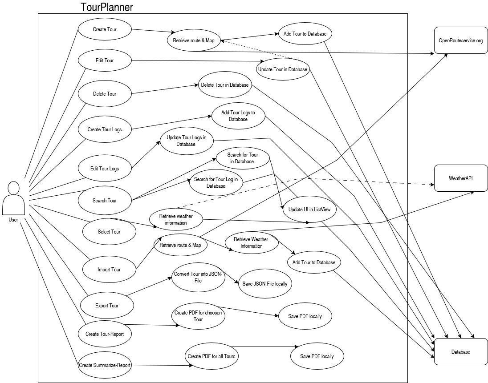
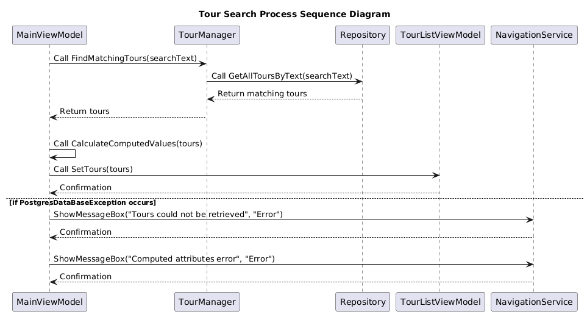
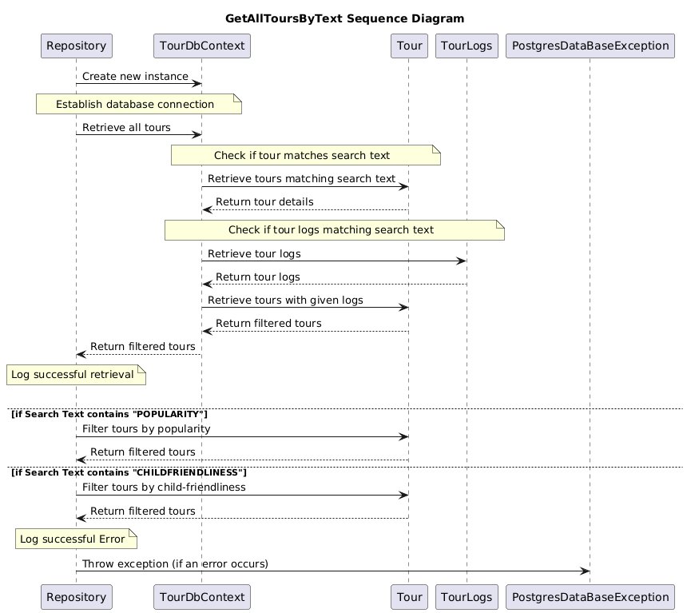

# TourPlanner

## Application Architecture
The TourPlanner application is developed in C# using the WPF framework and follows a three-layered architecture, implementing the MVVM (Model-View-ViewModel) pattern. The architecture is divided into the following layers:

- **Presentation Layer**:
This layer contains the views, which are responsible for the user interface and its visual representation. The views interact with the view models through data bindings and commands. The view models act as intermediaries between the UI and the business logic, handling user interactions, data manipulation, and communication with other layers.

- **Business Layer**:
The business logic layer implements the core functionalities of the application, such as creating and managing tours, generating reports, and handling tour logs. It encapsulates the main use cases and business rules.

- **Data Access Layer**:
Data is persisted in a PostgreSQL database using Entity Framework as the ORM. The models represent the data structures used in the application, including tours, tour logs, and weather information.

This layered approach ensures a clear separation of concerns between presentation, business logic, and data access, making the application maintainable and scalable.

## Use cases

Users of the TourPlanner can create new tours, each consisting of a name, description, starting point, destination, transport type, tour distance, estimated time, and route information. The application visualizes this information by displaying a map image of the tour, as well as the calculated distance and estimated time, which are retrieved via the OpenRouteService and OpenStreetMap APIs.

For each tour, users can create new tour logs to record their completed tour statistics. Each log contains the date and time, a comment, difficulty level, total distance, total time, and a rating for the tour. Multiple logs can be assigned to a single tour, and all logs can be viewed, edited, or deleted in a list view.

Users can search for tours and tour logs using a full-text search, which also considers computed attributes such as popularity and child-friendliness. Tour data can be imported and exported in JSON format for easy backup and sharing.

The application allows users to generate two types of reports: a tour report, which contains all information about a single tour and its associated tour logs, and a summary report, which provides average values (time, distance, rating) for each tour based on all related logs. Reports are generated as PDF files.

As a unique feature, the application retrieves real-time weather information for the tour destination using WeatherAPI.com. This enables users to plan their tours according to current weather conditions.

The use case diagram below illustrates these main functionalities available to users.

## Sequence diagram for full-text search

The sequence diagram for full-text search shows the flow from the user initiating a search, through the UI and business logic, to the data access layer, and finally displaying the results.

## Wireframes

## Unique Feature
Our TourPlanner application integrates the WeatherAPI.com service to provide real-time weather information for tour destinations. By displaying up-to-date weather data such as temperature, humidity, and wind speed, users can better plan and adjust their routes according to current conditions. This feature adds significant value by helping users make informed decisions and ensuring a safer, more enjoyable travel experience.
## Tracked time
| **David Fröschl**            | **Malwin Trimmel**         |
|-----------------------------|----------------------------|
| 05.04. 10:00 - 12:00         | 07.04. 15:00 - 17:00       |
| 10.04. 13:00 - 14:30         | 12.04. 10:00 - 11:30       |
| 15.04. 16:00 - 17:30         | 17.04. 14:00 - 15:30       |
| 20.04. 09:30 - 11:30         | 21.04. 13:00 - 14:30       |
| 25.04. 11:00 - 13:00         | 26.04. 09:00 - 11:00       |
| 30.04. 15:00 - 16:30         | 01.05. 14:00 - 15:30       |
| 05.05. 10:00 - 11:30         | 06.05. 15:30 - 17:00       |
| 10.05. 13:30 - 15:30         | 11.05. 10:00 - 12:00       |
| 15.05. 09:00 - 11:30         | 16.05. 14:00 - 16:00       |
| 20.05. 12:00 - 14:00         | 21.05. 13:00 - 15:00       |
| 25.05. 11:00 - 13:30         | 26.05. 09:30 - 11:30       |
| 30.05. 16:00 - 18:00         | 31.05. 13:00 - 15:00       |
| 03.06. 10:00 - 12:00         | 04.06. 14:30 - 16:30       |
| 05.06. 15:00 - 17:00         | 06.06. 16:00 - 18:00       |
| 01.07. 13:00 - 16:00         | 02.07. 10:00 - 13:00       |
| 03.07. 10:00 - 13:30         | 03.07. 14:00 - 17:00       |
| 04.07. 14:30 - 17:30         | 05.07. 09:30 - 12:30       |
| 06.07. 10:00 - 13:30         | 06.07. 10:00 - 12:30       |
| **Total time ⇒ 57h**         | **Total time ⇒ 53h**       |

**Total time required for the project ⇒ 110 hours**

## link to GIT

[https://github.com/MalwinTri/TourPlanner](https://github.com/MalwinTri/TourPlanner)
