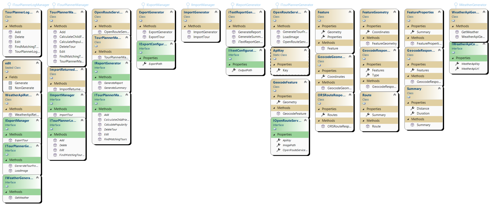
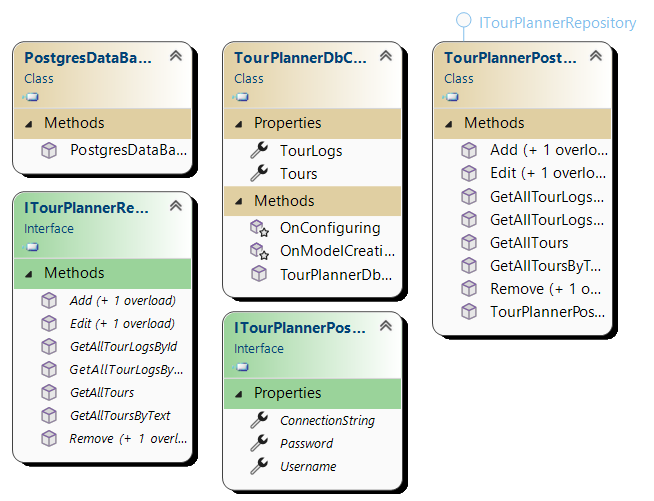
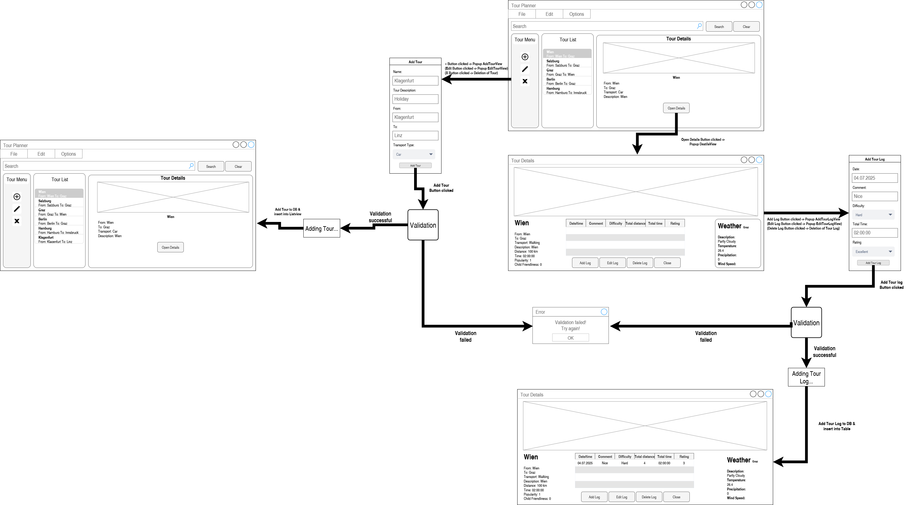

# TourPlanner

## Application Architecture
The TourPlanner application is developed in C# using the WPF framework and follows a three-layered architecture, implementing the MVVM (Model-View-ViewModel) pattern. The architecture is divided into the following layers:

- **Presentation Layer**:
This layer contains the views, which are responsible for the user interface and its visual representation. The views interact with the view models through data bindings and commands. The view models act as intermediaries between the UI and the business logic, handling user interactions, data manipulation, and communication with other layers.

- **Business Layer**:
The business logic layer implements the core functionalities of the application, such as creating and managing tours, generating reports, and handling tour logs. It encapsulates the main use cases and business rules.

- **Data Access Layer**:
Data is persisted in a PostgreSQL database using Entity Framework as the ORM. The models represent the data structures used in the application, including tours, tour logs, and weather information.

This layered approach ensures a clear separation of concerns between presentation, business logic, and data access, making the application maintainable and scalable.

## Class diagrams

### MVVM UML

### Business Layer UML

### Data Access Layer UML

## Use cases

Users of the TourPlanner can create new tours, each consisting of a name, description, starting point, destination, transport type, tour distance, estimated time, and route information. The application visualizes this information by displaying a map image of the tour, as well as the calculated distance and estimated time, which are retrieved via the OpenRouteService and OpenStreetMap APIs.

For each tour, users can create new tour logs to record their completed tour statistics. Each log contains the date and time, a comment, difficulty level, total distance, total time, and a rating for the tour. Multiple logs can be assigned to a single tour, and all logs can be viewed, edited, or deleted in a list view.

Users can search for tours and tour logs using a full-text search, which also considers computed attributes such as popularity and child-friendliness. Tour data can be imported and exported in JSON format for easy backup and sharing.

The application allows users to generate two types of reports: a tour report, which contains all information about a single tour and its associated tour logs, and a summary report, which provides average values (time, distance, rating) for each tour based on all related logs. Reports are generated as PDF files.

As a unique feature, the application retrieves real-time weather information for the tour destination using WeatherAPI.com. This enables users to plan their tours according to current weather conditions.

The use case diagram below illustrates these main functionalities available to users.

## Sequence diagram for full-text search

The sequence diagram for full-text search shows the flow from the user initiating a search, through the UI and business logic, to the data access layer, and finally displaying the results.

## Wireframes

## User Experience (UX) and Wireframes
The user interface of TourPlanner is designed to be intuitive and user-friendly. The main screens include:
- **Tour List View:** Displays all tours in a list with options to add, edit, or delete tours.
- **Tour Detail View:** Shows detailed information about a selected tour, including the map, distance, estimated time, and weather information.
- **Tour Log View:** Allows users to view, add, edit, or delete logs associated with a tour.
- **Search and Filter:** Provides a full-text search bar and filters for quick access to specific tours or logs.
- **Report Generation:** Users can generate and download PDF reports from the UI.
Wireframes and screenshots of these views are included in the documentation folder for reference.

## Library Decisions and Lessons Learned
- **iText7:** Used for generating PDF reports.
- **Entity Framework:** Used as the ORM for database access.
- **Log4Net:** Integrated for logging errors and application events.
- **Newtonsoft.Json:** Used for JSON serialization and deserialization.
- **OpenRouteService & OpenStreetMap:** Used for route calculation and map images.
- **WeatherAPI.com:** Used for retrieving real-time weather data.

**Lessons Learned:**
- The use of design patterns such as MVVM, Command, Observer, Factory, and Singleton greatly improved code maintainability and testability.
- Comprehensive unit testing is valuable for identifying and fixing errors early.
- Integrating external APIs (OpenRouteService, WeatherAPI) was challenging but added significant value.
- Proper error handling and logging are essential for robust software.
- Further decoupling of ViewModels and business logic would be beneficial in future versions.

## Implemented Design Patterns
- **MVVM:** Separates UI from business logic, improving maintainability.
- **Command Pattern:** Handles user actions from the UI.
- **Observer Pattern:** Enables communication between ViewModels.
- **Factory Pattern:** Used for creating logger instances.
- **Singleton Pattern:** Ensures only one instance of certain classes exists.

## Unit Testing Decisions

To ensure the reliability and correctness of our application, we implemented comprehensive unit tests using the **NUnit** framework. Our testing strategy focused on the following key areas:

- **Repository Layer:**
  - Tested all CRUD operations for tours and tour logs (add, edit, remove).
  - Verified that repository methods return expected results and handle data correctly.

- **Search Functionality:**
  - Tested searching tours and tour logs by text.
  - Ensured full-text search returns correct filtered results based on user queries.

- **Report Generation:**
  - Verified that PDF reports and summaries are created successfully by the iText report generator.
  - Checked that reports are generated with correct data and that directories are created if they do not exist.
  - Ensured the generator handles cases where no logs are found.

- **Error Handling:**
  - Deliberately triggered exceptions in report generation to ensure errors are properly logged and do not crash the application.

- **Edge Cases:**
  - Included tests for empty log lists, missing directories, and exception handling to ensure robustness.

- **Test Coverage:**
  - Covered all critical business logic, data access, and reporting features.
  - Implemented more than 20 unit tests, focusing on both typical and exceptional workflows.

This approach helped us to identify and fix issues early in the development process, resulting in a more stable and maintainable application.

## Unique Feature
Our TourPlanner application integrates the WeatherAPI.com service to provide real-time weather information for tour destinations. By displaying up-to-date weather data such as temperature, humidity, and wind speed, users can better plan and adjust their routes according to current conditions. This feature adds significant value by helping users make informed decisions and ensuring a safer, more enjoyable travel experience.
## Tracked time
| **David Fröschl**            | **Malwin Trimmel**         |
|-----------------------------|----------------------------|
| 05.04. 10:00 - 12:00         | 07.04. 15:00 - 17:00       |
| 10.04. 13:00 - 14:30         | 12.04. 10:00 - 11:30       |
| 15.04. 16:00 - 17:30         | 17.04. 14:00 - 15:30       |
| 20.04. 09:30 - 11:30         | 21.04. 13:00 - 14:30       |
| 25.04. 11:00 - 13:00         | 26.04. 09:00 - 11:00       |
| 30.04. 15:00 - 16:30         | 01.05. 14:00 - 15:30       |
| 05.05. 10:00 - 11:30         | 06.05. 15:30 - 17:00       |
| 10.05. 13:30 - 15:30         | 11.05. 10:00 - 12:00       |
| 15.05. 09:00 - 11:30         | 16.05. 14:00 - 16:00       |
| 20.05. 12:00 - 14:00         | 21.05. 13:00 - 15:00       |
| 25.05. 11:00 - 13:30         | 26.05. 09:30 - 11:30       |
| 30.05. 16:00 - 18:00         | 31.05. 13:00 - 15:00       |
| 03.06. 10:00 - 12:00         | 04.06. 14:30 - 16:30       |
| 05.06. 15:00 - 17:00         | 06.06. 16:00 - 18:00       |
| 01.07. 13:00 - 16:00         | 02.07. 10:00 - 13:00       |
| 03.07. 10:00 - 13:30         | 03.07. 14:00 - 17:00       |
| 04.07. 14:30 - 17:30         | 05.07. 09:30 - 12:30       |
| 06.07. 10:00 - 13:30         | 06.07. 10:00 - 12:30       |
| **Total time ⇒ 57h**         | **Total time ⇒ 53h**       |

**Total time required for the project ⇒ 110 hours**

## link to GIT

[https://github.com/MalwinTri/TourPlanner](https://github.com/MalwinTri/TourPlanner)
